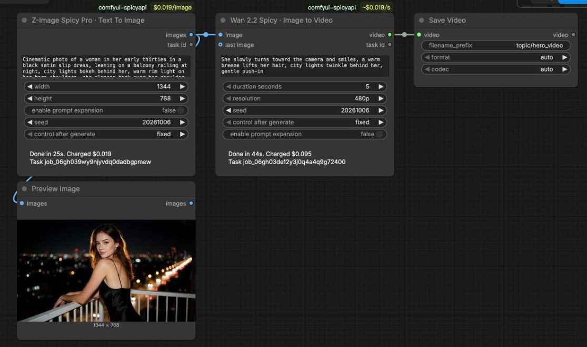
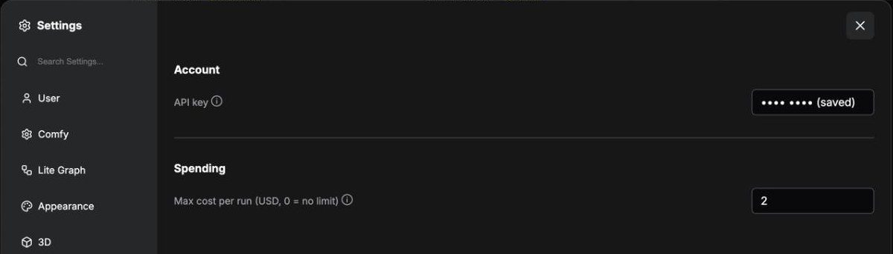
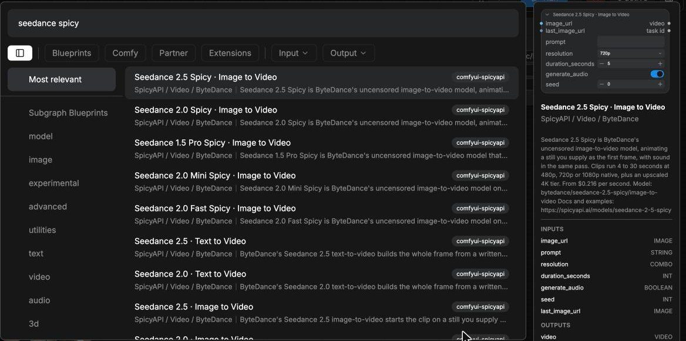

<div align="center">

# SpicyAPI for ComfyUI

**Seedance, Kling, Wan, MiniMax H3, Suno, GPT Image, Nano Banana and more AI models as ComfyUI nodes. No GPU, no model downloads.**

[Get an API key](https://spicyapi.ai/console/keys) · [Setup guide](https://docs.spicyapi.ai/docs/comfyui) · [All models](https://spicyapi.ai/models) · [Status](https://status.spicyapi.ai)

[](https://github.com/spicyapi-ai/comfyui-spicyapi/actions/workflows/tests.yml)
[](LICENSE)

</div>

---

**comfyui-spicyapi** is a ComfyUI custom node pack that runs hosted [SpicyAPI](https://spicyapi.ai) models
from inside your workflows. Each model is one node whose options come from that model's published
input schema, so the node offers exactly what the model accepts. Generation runs on SpicyAPI's
servers: you need an internet connection and an API key, not a graphics card or model weights.
Every request is paid in US dollars from a prepaid balance, and each node shows its price before it
runs.



<!-- stats:start -->
**189 model nodes** (104 video, 69 image, 16 audio) from 117 model families, plus 25 text models in one Chat node.
<!-- stats:end -->

## At a glance

| | |
| --- | --- |
| What it adds | One node per hosted model, a Chat node for text models, and a LoRA node |
| Inputs and outputs | Standard ComfyUI `IMAGE`, `MASK`, `VIDEO`, `AUDIO` and `STRING` |
| Hardware | None: models run on SpicyAPI, so it works on laptops, Macs and CPU-only machines |
| Dependencies | None beyond ComfyUI itself (Python 3.10+, the V3 node API; tested with ComfyUI 0.39) |
| Pricing | Pay per request from a prepaid USD balance; the rate is shown on every node |
| New models | Picked up automatically: the node list is rebuilt from your account at each start |
| License | MIT |

## Install

```bash
cd ComfyUI/custom_nodes
git clone https://github.com/spicyapi-ai/comfyui-spicyapi
```

Then restart ComfyUI. Prefer not to use git? Download the
[ZIP](https://github.com/spicyapi-ai/comfyui-spicyapi/archive/refs/heads/main.zip), unpack it into
`ComfyUI/custom_nodes`, and restart. There is nothing else to install.

## Quick start

1. **Add your key.** Open **Settings > SpicyAPI**, paste a key from
   [spicyapi.ai/console/keys](https://spicyapi.ai/console/keys); a notice shows your balance. Restart
   ComfyUI once so the node list comes from your account.

   
2. **Add a model node.** Double-click the canvas and type a model name (`seedance`, `kling`, `wan`,
   `suno`, `nano banana`...), or browse **SpicyAPI > Video / Image / Audio** in the node menu.

   
3. **Connect and run.** Wire a **Load Image** into the node's image input if the model takes one,
   connect **Save Image**, **Save Video** or **Save Audio** to its output, and press Run. The node
   shows its progress, then what the run cost.

Prefer to start from a working graph? Open ComfyUI's template browser: under **comfyui-spicyapi** you
will find text to image, image to video, a chat model writing the prompt for an image model, text
to speech, and LoRA.

## Supported models

The node list follows the live SpicyAPI catalogue. At the time of this release:

<!-- models:start -->
### Video (104 nodes)

| Maker | Models |
| --- | --- |
| MiniMax | [MiniMax H3 Singularity LoRA](https://spicyapi.ai/models/minimax-h3-singularity-lora), [MiniMax H3 Max](https://spicyapi.ai/models/minimax-h3-max), [MiniMax H3 LoRA](https://spicyapi.ai/models/minimax-h3-lora), [MiniMax H3 Spicy](https://spicyapi.ai/models/minimax-h3-spicy), [MiniMax H3](https://spicyapi.ai/models/minimax-h3) |
| Lightricks | [LTX 2.5](https://spicyapi.ai/models/ltx-2-5), [LTX 2.3 Spicy](https://spicyapi.ai/models/ltx-2-3-spicy), [LTX 2.3 Spicy LoRA](https://spicyapi.ai/models/ltx-2-3-spicy-lora), [LTX-2 19B](https://spicyapi.ai/models/ltx-2-19b), [LTX-2 19B LoRA](https://spicyapi.ai/models/ltx-2-19b-lora) |
| Alibaba | [Wan 3.0 Prime](https://spicyapi.ai/models/wan-3-0-prime), [Wan 3.0](https://spicyapi.ai/models/wan-3-0), [Wan 3.0 Pro Prime](https://spicyapi.ai/models/wan-3-0-pro-prime), [Wan 3.0 Pro](https://spicyapi.ai/models/wan-3-0-pro), [Wan 3.0 Spicy](https://spicyapi.ai/models/wan-3-0-spicy), [Wan 3.0 Prime Spicy](https://spicyapi.ai/models/wan-3-0-prime-spicy), [HappyHorse 1.1](https://spicyapi.ai/models/happyhorse-1-1), [Wan 2.7 Spicy](https://spicyapi.ai/models/wan-2-7-spicy), [Wan 2.6 Flash](https://spicyapi.ai/models/wan-2-6-flash), [Wan 2.6 Spicy](https://spicyapi.ai/models/wan-2-6-spicy), [Wan 2.6](https://spicyapi.ai/models/wan-2-6), [Wan 2.5](https://spicyapi.ai/models/wan-2-5), [Wan 2.2 Animate](https://spicyapi.ai/models/wan-2-2-animate), [Wan 2.2 Spicy](https://spicyapi.ai/models/wan-2-2-spicy), [Wan 2.2 Spicy LoRA](https://spicyapi.ai/models/wan-2-2-spicy-lora), [Wan 2.2 LoRA](https://spicyapi.ai/models/wan-2-2-lora), [Wan 2.2](https://spicyapi.ai/models/wan-2-2) |
| ByteDance | [Seedance 2.5 Spicy](https://spicyapi.ai/models/seedance-2-5-spicy), [Seedance 2.5](https://spicyapi.ai/models/seedance-2-5), [Seedance 2.0 Mini Spicy](https://spicyapi.ai/models/seedance-2-0-mini-spicy), [Seedance 2.0 Mini](https://spicyapi.ai/models/seedance-2-0-mini), [Seedance 2.0 Spicy](https://spicyapi.ai/models/seedance-2-0-spicy), [Seedance 2.0](https://spicyapi.ai/models/seedance-2-0), [Seedance 2.0 Fast Spicy](https://spicyapi.ai/models/seedance-2-0-fast-spicy), [Seedance 2.0 Fast](https://spicyapi.ai/models/seedance-2-0-fast), [Seedance 1.5 Pro Spicy](https://spicyapi.ai/models/seedance-1-5-pro-spicy), [Seedance 1.5 Pro](https://spicyapi.ai/models/seedance-1-5-pro) |
| Kling | [Kling 3.0 Turbo](https://spicyapi.ai/models/kling-3-0-turbo), [Kling O3](https://spicyapi.ai/models/kling-o3), [Kling 3.0](https://spicyapi.ai/models/kling-3-0), [Kling Avatar 2.0](https://spicyapi.ai/models/kling-avatar-2-0), [Kling 2.6](https://spicyapi.ai/models/kling-2-6), [Kling 2.5 Turbo](https://spicyapi.ai/models/kling-2-5-turbo), [Kling 2.1 Master](https://spicyapi.ai/models/kling-2-1-master), [Kling 2.1](https://spicyapi.ai/models/kling-2-1) |
| Vidu | [Vidu Q3 Turbo](https://spicyapi.ai/models/vidu-q3-turbo), [Vidu Q3 Spicy](https://spicyapi.ai/models/vidu-q3-spicy), [Vidu Q3](https://spicyapi.ai/models/vidu-q3), [Vidu Q3 Pro](https://spicyapi.ai/models/vidu-q3-pro) |
| Tencent | [HunyuanVideo 1.5](https://spicyapi.ai/models/hunyuan-video-1-5) |
| SpicyAPI tools | [Video Character Swap](https://spicyapi.ai/models/character-swap-v1), [Video Head Swap](https://spicyapi.ai/models/head-swap-video-v1), [Video Face Swap](https://spicyapi.ai/models/face-swap-video-v1), [Video Upscaler](https://spicyapi.ai/models/video-upscaler-v1), [Talking Avatar](https://spicyapi.ai/models/talking-avatar-v1), [Lip Sync](https://spicyapi.ai/models/lip-sync-v1), [Video Sound Effects](https://spicyapi.ai/models/foley-v1) |

### Image (69 nodes)

| Maker | Models |
| --- | --- |
| Alibaba | [Qwen Image 2.1](https://spicyapi.ai/models/qwen-image-2-1), [Qwen Image 2.1 LoRA](https://spicyapi.ai/models/qwen-image-2-1-lora), [Qwen Image 3.0 Pro](https://spicyapi.ai/models/qwen-image-3-0-pro), [Qwen Image 3.0](https://spicyapi.ai/models/qwen-image-3-0), [Qwen Image Edit Spicy](https://spicyapi.ai/models/qwen-image-spicy-edit), [Wan 2.7 Pro](https://spicyapi.ai/models/wan-2-7-pro), [Wan 2.7](https://spicyapi.ai/models/wan-2-7), [Qwen Image 2](https://spicyapi.ai/models/alibaba-qwen-image-2), [Z-Image Base LoRA](https://spicyapi.ai/models/z-image-base-lora), [Qwen Image 2512 LoRA](https://spicyapi.ai/models/qwen-image-2512-lora), [Z-Image Spicy Pro](https://spicyapi.ai/models/z-image-spicy-pro), [Z-Image Spicy](https://spicyapi.ai/models/z-image-spicy), [Z-Image](https://spicyapi.ai/models/z-image), [Z-Image Turbo LoRA](https://spicyapi.ai/models/z-image-turbo-lora) |
| ByteDance | [Seedream 5.0 Flash](https://spicyapi.ai/models/seedream-5-0-flash), [Seedream 5.0 Pro](https://spicyapi.ai/models/seedream-5-0-pro), [Seedream 5.0 Lite](https://spicyapi.ai/models/seedream-5-0-lite), [Seedream 4.0](https://spicyapi.ai/models/seedream-4-0) |
| OpenAI | [GPT Image 2.5 Sunburst](https://spicyapi.ai/models/gpt-image-2-5-sunburst), [GPT Image 2.5 Flare](https://spicyapi.ai/models/gpt-image-2-5-flare), [GPT Image 2](https://spicyapi.ai/models/gpt-image-2) |
| MiniMax | [MiniMax H3 Image LoRA](https://spicyapi.ai/models/minimax-h3-image-lora) |
| CircleStone Labs | [Anima Turbo](https://spicyapi.ai/models/anima-turbo), [Anima Turbo LoRA](https://spicyapi.ai/models/anima-turbo-lora) |
| Krea | [Krea 2 Large](https://spicyapi.ai/models/krea-2-large), [Krea 2 Medium Turbo](https://spicyapi.ai/models/krea-2-medium-turbo), [Krea 2 Medium](https://spicyapi.ai/models/krea-2-medium) |
| Google | [Nano Banana 2](https://spicyapi.ai/models/nano-banana-2), [Nano Banana Pro](https://spicyapi.ai/models/nano-banana-pro) |
| J1B | [Jib Mix Qwen](https://spicyapi.ai/models/jib-mix-qwen-image), [Jib Mix Qwen LoRA](https://spicyapi.ai/models/jib-mix-qwen-image-lora) |
| Prefect | [Prefect Pony XL LoRA](https://spicyapi.ai/models/prefect-pony-xl-lora), [Prefect Pony XL](https://spicyapi.ai/models/prefect-pony-xl) |
| Neta.art Lab | [Neta Lumina](https://spicyapi.ai/models/neta-lumina) |
| Black Forest Labs | [FLUX.1 Dev LoRA](https://spicyapi.ai/models/flux-1-dev-lora) |
| SpicyAPI tools | [Face Swap Pro](https://spicyapi.ai/models/face-swap-pro-v1), [Face Swap Plus](https://spicyapi.ai/models/face-swap-v1-plus), [Celebrity Look-Alike](https://spicyapi.ai/models/look-alike-v1), [Face Swap](https://spicyapi.ai/models/face-swap-v1), [Head Swap](https://spicyapi.ai/models/head-swap-v1), [Background Remover](https://spicyapi.ai/models/background-remover-v1), [Image Upscaler](https://spicyapi.ai/models/image-upscaler-v1), [Object Eraser](https://spicyapi.ai/models/object-eraser-v1), [Image Expander](https://spicyapi.ai/models/image-expander-v1) |

### Audio (16 nodes)

| Maker | Models |
| --- | --- |
| Google | [Gemini 3.8 Flash-Lite TTS](https://spicyapi.ai/models/gemini-3-8-flash-lite-tts), [Gemini 3.8 Flash TTS](https://spicyapi.ai/models/gemini-3-8-flash-tts), [Gemini 2.5 Pro TTS](https://spicyapi.ai/models/gemini-2-5-pro-tts) |
| Suno | [Suno v6 Mini](https://spicyapi.ai/models/suno-v6-mini), [Suno v6 Wild](https://spicyapi.ai/models/suno-v6-wild), [Suno v6](https://spicyapi.ai/models/suno-v6) |
| HeartMuLa | [HeartMuLa Transcribe](https://spicyapi.ai/models/heartmula-transcribe) |
| ByteDance | [Seed Audio 1.0](https://spicyapi.ai/models/seed-audio-1-0), [Seed Speech 2.0](https://spicyapi.ai/models/seed-speech-2-0) |
| MiniMax | [MiniMax Music 3.0](https://spicyapi.ai/models/minimax-music-3-0), [MiniMax Speech 2.8 HD](https://spicyapi.ai/models/minimax-speech-2-8-hd), [MiniMax Speech 2.8 Turbo](https://spicyapi.ai/models/minimax-speech-2-8-turbo) |
| xAI | [Grok STT](https://spicyapi.ai/models/grok-stt), [Grok TTS](https://spicyapi.ai/models/grok-tts) |
| Alibaba | [Qwen3 TTS](https://spicyapi.ai/models/qwen-3-tts) |
| Resemble AI | [Chatterbox](https://spicyapi.ai/models/chatterbox-v1) |

### Text (25 models in the SpicyAPI Chat node)

Claude Sonnet 5.5, Claude Opus 5.5, Grok 4.7, DeepSeek V4.1 Flash, GLM 5.3 Flash, GLM 5.3, DeepSeek V4 Pro, Gemini 3.7 Flash, Grok 4.6, DeepSeek V4 Flash, Claude Opus 5, Gemini 3.5 Flash-Lite, Kimi K3, Grok 4.5, Claude Sonnet 5, GLM 5.2, Claude Fable 5, Grok 4.3, Gemini 3.1 Pro Preview, Claude Sonnet 4.6, Claude Opus 4.6, Gemini 3 Flash Preview, Claude Opus 4.5, Claude Sonnet 4.5, Gemini 2.5 Flash.

Every node with its model ID and starting price: [MODELS.md](MODELS.md).
<!-- models:end -->

## How the nodes work

- **Inputs follow the model.** Dropdowns, sliders and switches mirror each model's schema. Image,
  video and audio inputs are sockets, uploaded for you when the node runs. Models that take several
  references grow a new socket every time you connect one.
- **Defaults are the model's own.** A dropdown set to `model default`, or a number set to `-1`,
  is left out of the request so the model decides.
- **Outputs are ordinary ComfyUI values.** Video nodes return `VIDEO` (and the last frame as `IMAGE`
  when `return_last_frame` is on), audio nodes return `AUDIO`, image nodes return `IMAGE`, and
  background removal also returns an `alpha` mask. Transcription returns `STRING`.
- **SpicyAPI Chat** sends a prompt, optional system instructions and optional images to any text
  model on SpicyAPI and returns the answer as a `STRING`, ready to wire into another node's prompt.
- **SpicyAPI LoRA** adds a LoRA weights file by URL to models with LoRA support. Chain several to
  stack them.


## Costs and safety

- **Price on the node.** Each node's badge shows the current rate for the options you picked, for
  example `$0.0525/s` for video or `$0.01/image`, and updates as you change them.
- **Quote before every run.** Set **Settings > SpicyAPI > Max cost per run** and any run quoted
  above it stops before anything is charged.
- **No surprise re-runs.** Seeds start on `fixed`, so queueing the same graph twice reuses the
  first result. Switch **control after generate** to `randomize` for a new result each run.
- **Your key stays out of shared files.** It is stored in the ComfyUI user folder
  (`user/spicyapi/config.json`, readable by your account only), never in a workflow or the
  metadata of a saved image. On a server, set `SPICY_API_KEY` instead.
- **Cancelling stops the wait, not the job.** A cancelled run keeps going on SpicyAPI, is charged
  if it succeeds, and its result is in your console for up to 14 days.

## FAQ

### How do I use Seedance in ComfyUI?

Install this pack and add your key, then add the **Seedance 2.5 · Image to Video** node (or any
other Seedance node), connect **Load Image** to its `image` input and **Save Video** to its
`video` output, write a prompt and run. Resolution, duration and audio are options on the node.
The same steps work for Kling, Wan, MiniMax H3, Vidu and LTX video models.

### Do I need a GPU or to download model weights?

No. The models run on SpicyAPI's servers, and the nodes only send inputs and receive results. A
laptop or a CPU-only machine is enough.

### How much does a run cost?

Each model has its own rate, shown on the node and on its page at
[spicyapi.ai/models](https://spicyapi.ai/models): image models are priced per image, video models per
second of output, speech per character, per second or per request. A run is quoted before it starts, and the
node prints the final charge when it finishes. Failed runs are not charged unless a model's page
says otherwise.

### Is my API key safe when I share a workflow or an image?

Yes. ComfyUI writes node settings into workflow files and into PNG metadata, so the key is never
a node setting. It lives in a file in your ComfyUI user folder, or in the `SPICY_API_KEY`
environment variable.

### Can I use my own LoRA?

Yes, with the LoRA model nodes (their names end in `LoRA`). Add a **SpicyAPI LoRA** node with a
direct download link to a `.safetensors` file and its strength, and connect it to the model node's
`loras` input. The link must open without a login. The **lora** template comes ready to run with an
Apache-2.0 pixel-art LoRA for Z-Image Turbo (by tarn59 on Hugging Face); swap in your own link.

### A model I saw on spicyapi.ai is not in my node list

Restart ComfyUI. The node list is built from your account's catalogue when ComfyUI starts, so models
added since the last start appear after a restart. Without a key, the list bundled with this
release is used.

### Does it work with ComfyUI on a remote server or in the cloud?

Yes, as long as that machine can reach `api.spicyapi.ai`. Set `SPICY_API_KEY` in its environment,
or enter the key in Settings from the browser. Proxies set through `HTTPS_PROXY` are honoured.

## Troubleshooting

| You see | What to do |
| --- | --- |
| `No SpicyAPI key is set` | Add the key in Settings > SpicyAPI, or set `SPICY_API_KEY`. |
| `40310` email not verified | Open the verification link from your sign-up email. |
| `40004` no deployment serves this combination | Change the option named in the message. |
| An error ending in `request_id ...` | Send that id to support; it identifies the request exactly. |
| `a proxy or firewall ... may be intercepting the request` | Check that `HTTPS_PROXY`, if set, points at a working proxy. |

## Other ways to use SpicyAPI

- [Python SDK](https://github.com/spicyapi-ai/spicy-python), [TypeScript SDK](https://github.com/spicyapi-ai/spicy-sdk),
  [Go](https://github.com/spicyapi-ai/spicy-go), [PHP](https://github.com/spicyapi-ai/spicy-php) and
  [Java](https://github.com/spicyapi-ai/spicy-java) clients
- [CLI](https://github.com/spicyapi-ai/spicy-cli) for the terminal, and an [MCP server](https://github.com/spicyapi-ai/spicy-mcp) for AI assistants
- [Documentation](https://docs.spicyapi.ai) and the [API reference](https://docs.spicyapi.ai/docs/api-reference)

## Development

```bash
python -m unittest discover -s tests -t .
python scripts/update_snapshot.py   # needs SPICY_API_KEY; refreshes the bundled model list
python scripts/render_docs.py       # rewrites the model lists in README.md and MODELS.md
```

## License

[MIT](LICENSE)
